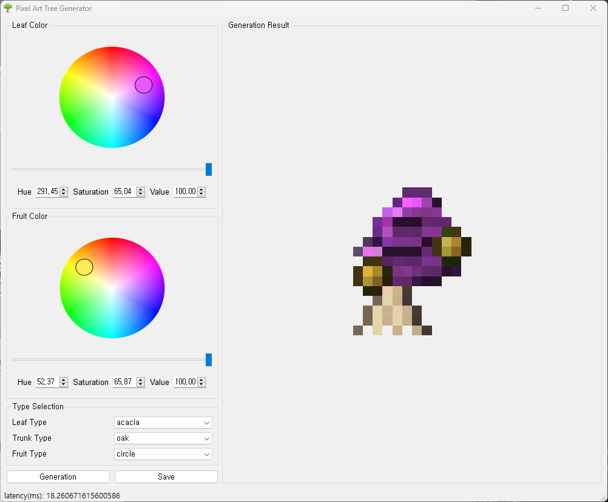
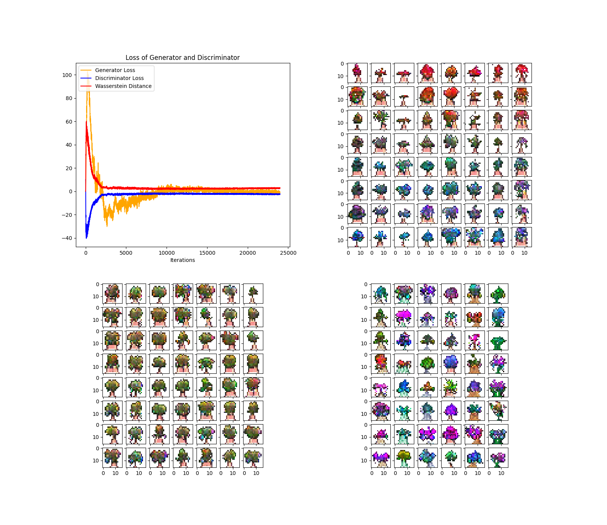
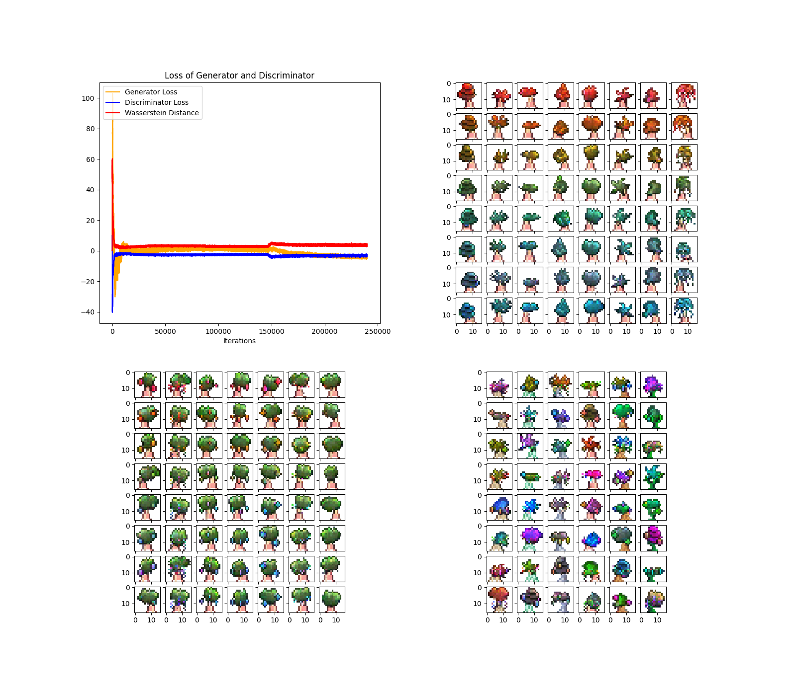
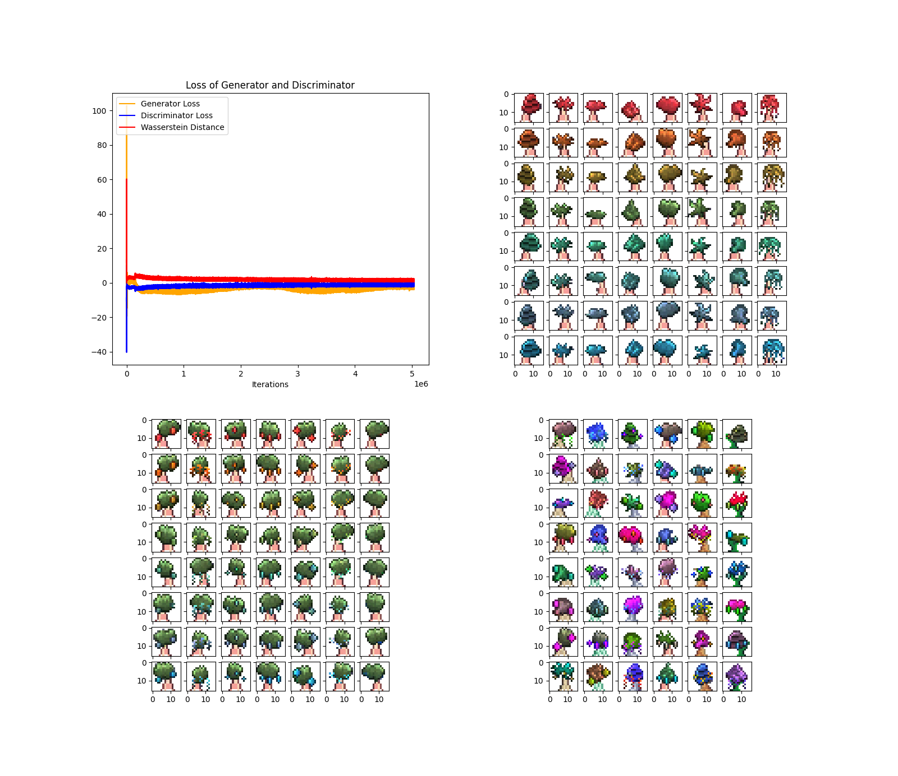

# Pixel Art Tree Generator

---

This is the toy project: Pixel Art Tree Generator based on WGAN-GP implemented by PyTorch.

## Installation

---

This project is implemented on [Pipenv](https://pipenv.pypa.io/en/latest/) environment. Please refer to Pipfile for information on the package needed.

```shell
git clone https://github.com/DoHunKim1215/Pixel-Art-Tree-Generator.git
pipenv install
```

## Run

---

Pretrained weights is provided at "result/best.pkl".

```shell
python3 app.py --model_path <path/to/checkpoint> --image_out_dir <path/to/image>
```



## Train

---

```shell
python3 train.py --data_dir <path/to/dataset> --model_out_dir <path/to/checkpoint> --fig_out_dir <path/to/loss_plot>
```

## Training Result

---

* Epoch 1



* Epoch 10



* Epoch 210



## Dataset

---

* [Pixel Art Tree (Kaggle)](https://www.kaggle.com/datasets/juansblanco/pixel-art-trees)

## Reference

---

* [Ian J. Goodfellow et al. "Generative Adversarial Networks" (2014)](https://arxiv.org/abs/1406.2661)
* [Mehdi Mirza et al. "Conditional Generative Adversarial Nets" (2014)](https://arxiv.org/abs/1411.1784)
* [Alec Radford et al. "Unsupervised Representation Learning with Deep Convolutional Generative Adversarial Networks" (2016)](https://arxiv.org/abs/1511.06434)
* [Martin Arjovsky et al. "Wasserstein GAN" (2017)](https://arxiv.org/abs/1701.07875)
* [Ishaan Gulrajani et al. "Improved Training of Wasserstein GANs" (2017)](https://arxiv.org/abs/1704.00028)